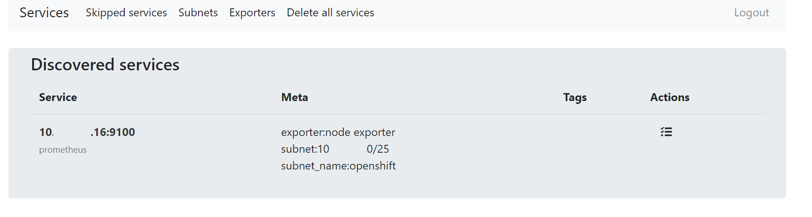
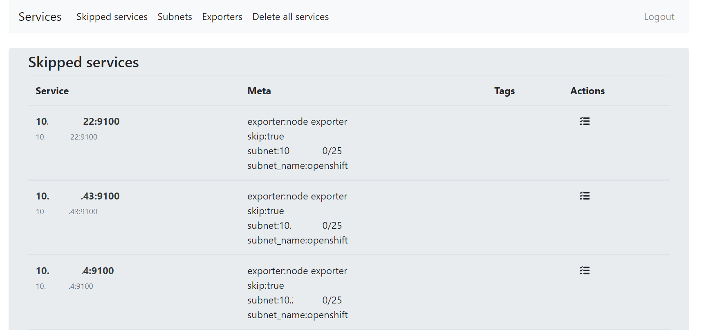
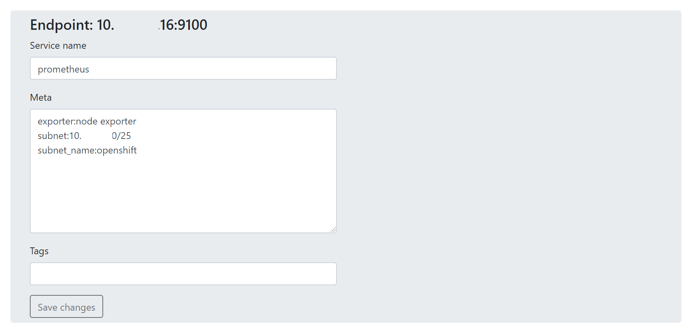
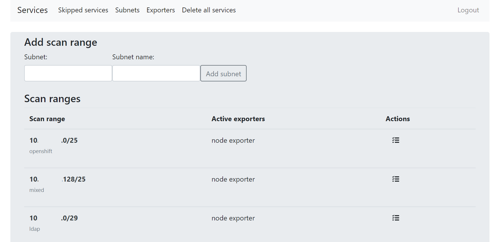
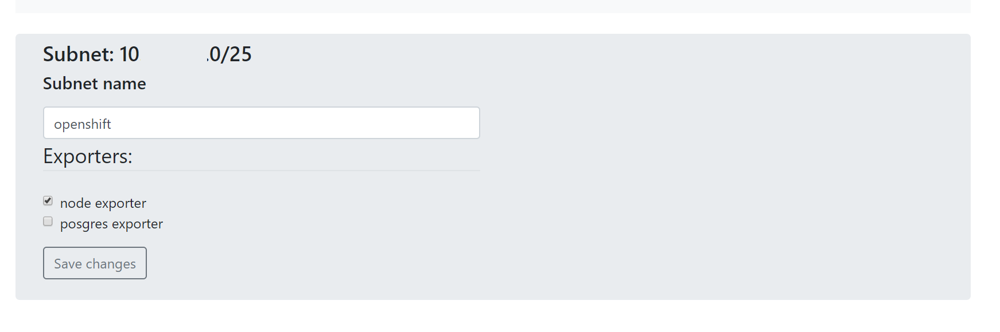
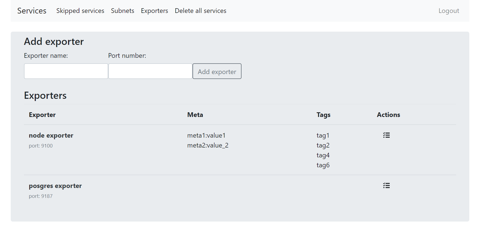
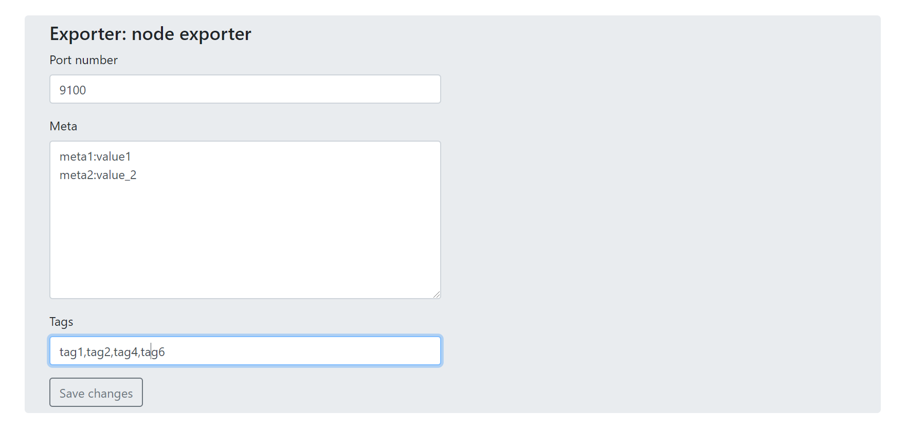
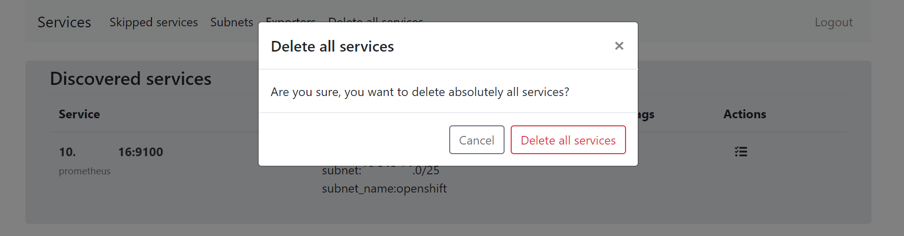

## PROMENAD - Prometheus Exporter Network Auto Discovery
### Назначение
Утилита предназначена для автоматического поиска и добавления в прометей экспортеров по подсетям.

В качестве интерфейса связи с прометеем используется consul
### Возможности 
#### Сервисы
##### Сервисы - обнаруженные инстансы экспортера, с которого необходимо собирать метрики

Отображает текущие инстансы экспортеров, примененные мета информация и теги.
Через меню Actions можно отредактировать сервис, 
остановить отслеживание в прометее либо удалить сервис, 
если он более не нужен. 
Так же отредактировать сервис возможно, кликнув по имени сервиса.

Остановка отслеживания выполняется через добавление в Мета значения skip:true.
В прометее должно быть указано соответствующее правило на остановку мониторинга по данному ключу.

##### Автоматически добавляемая мета информация
Вне зависимости от записанных значений мета в экспортере, в сервис всегда добавляется информация о подсети и ее имени 
и имени экспортера, по которому сервис был обнаружен.

##### Список сервисов, не отслеживаемых прометеем

В данном списке содержатся сервисы, которые прометей не должен отслеживать.
Через меню Actions можно отредактировать сервис, 
восстановить отслеживание либо удалить сервис.

##### Редактирование сервиса

Можно указать человекопонятное имя хоста, изменить мета информацию и теги.
По данным полям впоследствии можно фильтровать метрики в прометее.
Мета информацию задается в формате NAME:VALUE,
каждое значение с новой строки. Теги указываются через запятую.

#### Subnets
##### Список текущих подсетей для сканирования, добавление новых подсетей.

Сети должны быть описаны в нотации CIDR.

Через меню Actions можно запустить немедленное сканирование подсети по включенным экспортерам,
отредактировать либо удалить подсеть. Так же отредактировать подсеть возможно, кликнув по имени подсети.

##### Редактирование подсети

Можно изменить имя подсети, а так же указать, какие экспортеры применять для данной подсети

#### Exporters
##### Отображение списка экспортеров, добавление нового экспортера

Отредактировать экспортер можно либо через меню Actions, либо кликнув по имени экспортера.
Так же через меню Actions можно удалить экспортер, если он более не нужен. При этом экпортер удалится из всех подсетей, 
где экспортер был включен.

##### Редактирование экспортера

Можно изменить порт экспортера, добавить мета информацию, теги.
Теги и мета информация будут добавлены во вновь обнаруженные сервисы.
Впоследствии по ним можно фильтровать метрики в прометее.
Мета информацию задается в формате NAME:VALUE,
каждое значение с новой строки. Теги указываются через запятую.
Для уже обнаруженных сервисов мета и теги не обновляются.

#### Удаление всех сервисов
В случае необходимости, можно удалить все сервисы.

Перед удалением необходимо подтвердить действие.

### Настройка
Базовая настройка осуществляется через переменные окружения
#### Переменные окружения
| Var                     | Desciption                                     | Default                             | Mandatory |
|-------------------------|------------------------------------------------|-------------------------------------|-----------|
| AUTH_TOKEN              | Секретный пароль, необходим для работы FLASK   | you-will-never-guess                | yes       |
| PROMENAD_SCAN_ENDPOINT  | URL endpoint для автоматического сканирования  | http://127.0.0.1:8000/services/scan | No        |
| PROMENAD_SCAN_INTERVAL  | Интервал сканирования подсетей                 | 600                                 | No        |
| LDAP_HOST               | URL LDAP для авторизации                       | localhost:389                       | yes       |
| LDAP_BASE_DN            | LDAP BASE DN                                   | dc=org,dc=ru                         | yes       |
| CONSUL_HOST             | Хост Consul для работы сервиса                 | consul.monitoring.svc               | yes       |
| CONSUL_PORT             | Порт Consul                                    | 8500                                | yes       |
| CONSUL_SCHEME           | Схема подключения к Consul (HTTP/HTTPS)        | http                                | No        |
| SERVER_NAME             | Имя сервера, на который будет отвечать FLASK   | 0.0.0.0:8000                        | No        |

При необходимости можно переписать [конфиг](config.py), например, 
указать собственный параметры фильтрации и подключения к LDAP или указать сертификат для подключения к Consul.

#### Примеры конфигов
[Пример конфига прометея](docs/prometheus_config.md)

[Dockerfile](Dockerfile)

